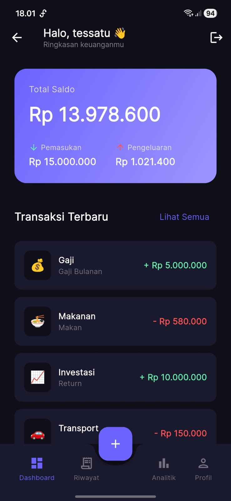
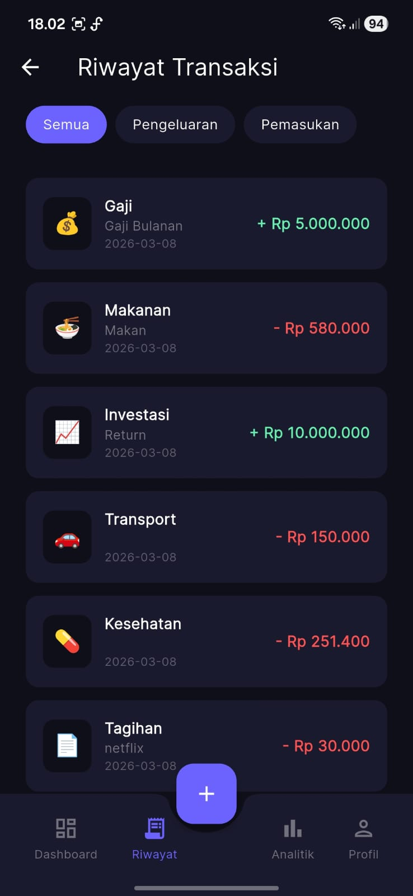
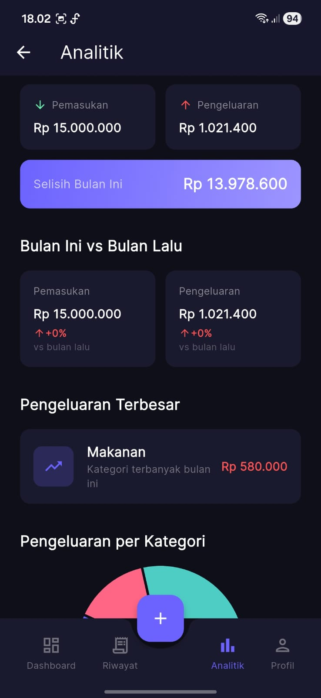

# Expense Tracker Flutter

Aplikasi pelacak keuangan pribadi modern dan aman yang dibangun dengan Flutter, Firebase, dan Cloudflare Workers untuk otomatisasi pencatatan perbankan.

---

## 📱 Screenshots

<p align="center">
  
  &nbsp;&nbsp;&nbsp;&nbsp;
  
  &nbsp;&nbsp;&nbsp;&nbsp;
  
</p>

---

## 🛠️ Tech Stack

- **Frontend:** Flutter (Dart 3)
- **Database & Auth:** Firebase Authentication & Cloud Firestore
- **Backend:** Cloudflare Workers (TypeScript / Serverless)
- **AI Engine:** Google Gemini AI (Ekstraksi Struk Belanja & Smart Parser Mutasi)
- **Visualisasi & Charts:** `fl_chart`
- **Keamanan:** `local_auth` (Biometrik Sidik Jari & PIN)
- **Notifikasi:** `flutter_local_notifications` & `timezone`

---

## ✨ Fitur Utama

- **Dashboard Keuangan:** Ringkasan total saldo, pemasukan, pengeluaran, dan mutasi terbaru.
- **Pencatatan Transaksi Fleksibel:** Model pemilihan kategori dropdown dengan opsi input nama kategori kustom jika memilih "Lainnya".
- **Scan Struk Gemini AI:** Foto nota belanja untuk mengisi nominal, tanggal, toko, dan kategori secara otomatis.
- **Sinkronisasi Otomatis Bank (Livin' Mandiri):** Membaca notifikasi mutasi via Gmail dengan parser tangguh 2 lapis (Regex Sinonim Perbankan + Fallback AI).
- **Multi-Rekening / Dompet:** Pengelolaan saldo terpisah untuk berbagai bank dan e-wallet.
- **Pengingat & Notifikasi Akurat:** Pengingat transaksi tunai, peringatan batas anggaran dinamis (50% - 95%), serta pengingat jatuh tempo fleksibel (H-jam / H-hari).
- **Analitik & Laporan PDF:** Grafik interaktif, navigasi riwayat bulan, rata-rata belanja harian (*burn rate*), dan ekspor laporan bulanan ke format PDF.
- **Keamanan Biometrik:** Kunci aplikasi menggunakan sensor sidik jari dengan cadangan PIN perangkat.

---

## 🚀 Panduan Setup

### 1. Clone Repositori
```bash
git clone https://github.com/username/expense_tracker_flutter.git
cd expense_tracker_flutter
```

### 2. Install Dependensi
```bash
flutter pub get
```

### 3. Konfigurasi Firebase
1. Buat proyek baru di [Firebase Console](https://console.firebase.google.com).
2. Aktifkan **Authentication** (Email/Password & Google Sign-In) dan **Cloud Firestore**.
3. Hubungkan aplikasi Flutter dengan menjalankan:
   ```bash
   flutterfire configure
   ```
   *(File `google-services.json` dan `firebase_options.dart` otomatis dibuat dan tidak terlacak di Git).*

### 4. Konfigurasi Backend (Cloudflare Worker)
1. Buka folder `backend`:
   ```bash
   cd backend
   npm install
   ```
2. Deploy worker ke akun Cloudflare Anda:
   ```bash
   npx wrangler deploy
   ```
3. Set secret rahasia di Cloudflare:
   ```bash
   npx wrangler secret put WORKER_AUTH_TOKEN
   npx wrangler secret put GEMINI_API_KEY
   ```
4. Di aplikasi Flutter, salin file template konfigurasi:
   ```bash
   cp lib/config/app_config.example.dart lib/config/app_config.dart
   ```
   Isi `app_config.dart` dengan URL worker dan token rahasia Anda.

### 5. Jalankan Aplikasi
```bash
flutter run
```

---

## 📦 Build APK

```bash
flutter build apk --release
```

---

## 🔒 Keamanan & Privasi

Proyek ini dirancang dengan prinsip *zero-credential leakage*:
- Semua token perbankan dan API key disimpan di Cloudflare Secrets atau file konfigurasi lokal yang terisolasi dari Git (`.gitignore`).
- Data transaksi dan autentikasi disimpan di Cloud Firestore dengan aturan keamanan (*Security Rules*) berbasis kepemilikan akun.

---

## 👤 Developer
Dikembangkan oleh **YRJ**
